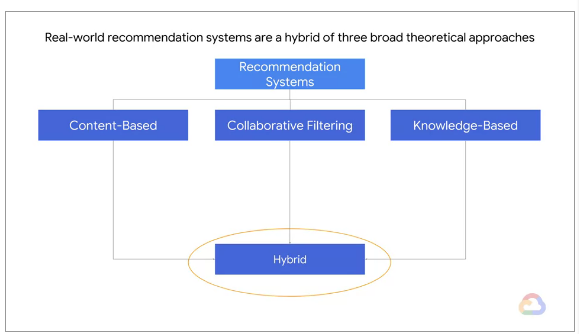
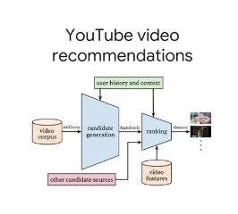
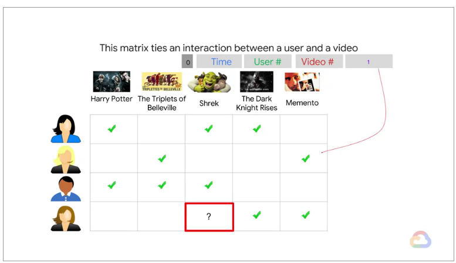
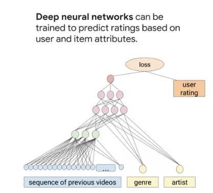
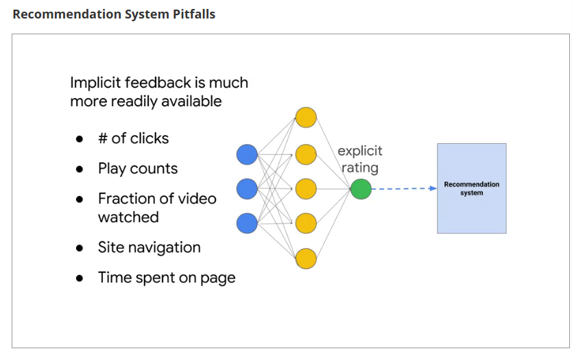
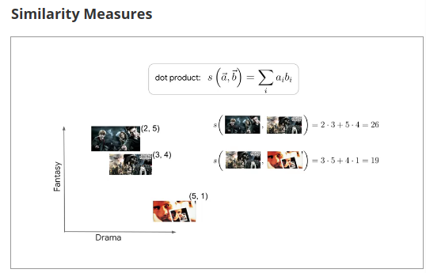
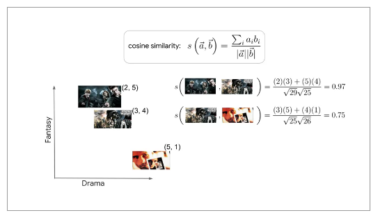

# Recommendations Systems with TensorFlow 

Not only recommending products to users but also user to products (known as *targeting* in marketing).

A famous example:

## Recommendation Systems

Not only "products" are being recommended. For example google maps suggests a route as a recommendation systems. Possible replies in an email in gmail is also one good example. 

**Key idea**:       

Recommend new content that an user may like but have never searched before.  

### Content-based Recommendation System

Knowing metadata about a product, e.g. movies, 
this approach uses attributes of a particular user and products and see how an individual user aligns with these features. 

### Collaborative Filtering (CF)

You don't have metadata but rather the model learns about users and product similarities. 

A big interaction matrix can be decomposed (approximated) in two matrices: user factors and item factors.

CF uses similarities between users and items simultaneously to determine recommendations. 

### Knowledge-based 
Use explicit knowledge about the users, items, and recommendation criteria. Here we do not have previous information. E.g., because most people don't buy houses often, we probably wouldn't have enough previous house buying information to use either a content-based or collaborative filtering approach. 

### Neural Networks for Recommendation Systems

If you do have metadata and interactions metrics you can combine models into a hybrid model and train a deep neural network to predict the ranking of a set of products. The highest ranked products are then recommended to the user.

### Recommendation System Pitfalls

- User Space and product space are skeewed.
    - Some properties are very popular 
    - Some users are very prolific 
- Naive solution over emphasize certain users or products
- The [cold start problem](https://en.wikipedia.org/wiki/Cold_start_recommender_systems) appears when there aren't enough interactions for users or items. 
    > Cold start:
    > it concerns the issue that the system cannot draw any inferences for users or items about which it has not yet gathered sufficient information.
    > --- <cite>[Wikipedia]</cite>
- Explicit user feedback is **often rare** or **unobservable** (example use other information or proxies, e.g. youtube video,  like # clicks, play of counts, fraction of video watched, site navigation, time spent on page. WE can call these proxies *implicit rankings* or *feedback*)

How to address the cold start: 

- Rely on a content-based method instead for new users:  
Content-based systems require that we either base our recommendations solely on the properties of the items, by looking for similar items for example, or that we have representations of our users in the same embedding space of our items. For a trivial example, by asking users which genres they prefer, we could make content-based recommendations using representations of items with genres as features.
- Ask the user for some basic preferences: 
  With only a few preferences, we could classify users into to different personas we've derived across our user-base and base our recommendations on the preferences of this entire group

Example of implicit feed

### Similarity Measures

We want to compare products and users and how similar they are. For that we need to map them via embedding. An embedding is map from our collection of items to some finite dimensional vector space. 

**Hint: Dimensionality reduction**

We take the embedding values as the coordinates in an embedded space.

One similarity measure can be the dot product. 

Cosine similarity:

### Building a User Vector

Represent all items in the embedded feature space. 

Ratings (user-item rating vector or matrix) x Product Matrix Embedded Space (or also called item-feature matrix) = Weighted feature (matrix)

The User Feature vector represents a value of affinity of the user to a vector of products 

Finally, the recommendations are the result of the dot product of the calculated user feature vector and the feature embedded space:

User Feature Vector %*% Feature Embedded Space = Vector of Ratings 

Hence, we recommend the highest rated products in the vector of ratings. 

**item-feature** matrix is a k-hot encoding representation of the products in the embedded space. 

## Building End-to-End Recommendation Systems

